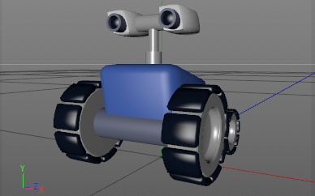
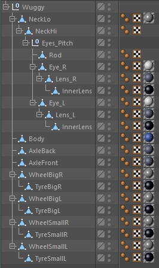
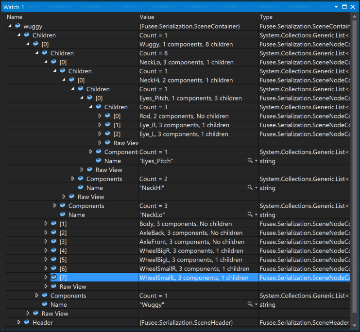

#Tutorial 05

##Goals
 - Understand FUSEE's built-in SceneGraph and traversal functionality
 - Implement a more complex shader with one arbitrary light source

##Shaders are Assets now 
Build and run Tutorial 05. The output looks like we left off at [Tutorial 04](../Tutorial04). Under the hood we have one small enhancement:
Vertex and Pixel Shader are now in seperate source files: `VertexShader.vert` and `PixelShader.frag`. Both files can be found
under the `Assets` folder in the Core project.

All text files marked as `Content` with either file extension `.vert` (for vertex shader) or `.frag` (for fragment shader - the OpenGL terminology
for pixel shader) will be compiled using the [OpenGL reference compiler] (https://www.khronos.org/opengles/sdk/tools/Reference-Compiler/) *before*
the C# source code itself will be compiled. Thus you will get errors reported directly in the build output and will not have to run the program
to find any errors in your shader code wrapped in some exceptions at run-time.

In addition you might want to install the latest [release of the NShader Syntax Hilighter] (https://github.com/samizzo/nshader/releases) 
(See the [project web site] (http://www.horsedrawngames.com/shader-syntax-highlighting-in-visual-studio-2013/) for additional information).
This Visual Studio Extension produces visual support like shown below while editing your shader code:

##FUSEE's built-in SceneGraph
In Tutorial 04 we created a simple class, `SceneOb` that we used to create hierarchical scene graphs. In addition we added a method `RenderSceneOb()` 
that went through a tree of `SceneOb` instances and rendered the contents of the individual `SceneOb`s. From now on we will call the process of 
going through a hierarchy of objects ***traversing*** the tree. In addition we will call a hierarchy of objects making up parts of a 3D scene
a **Scene Graph***.

FUSEE already comes with a set of classes allowing to build up Scene Graphs. You can find these classes in the [Fusee.Serialization project]
(https://github.com/FUSEEProjectTeam/Fusee/tree/develop/src/Serialization). All classes found here can be serialized and deserialized using 
automatically generated serialization code. In Tutorial 04 you already used these classes to load a `.fus` file and retrieve some 
Mesh data out of it. But `.fus` can not only store simple meshes but can contain complete scene graphs.

A Scene Graph in FUSEE is always a tree of `SceneNodeContainer` objects (we will just call them *nodes*). 
Take a look at the [source code] (https://github.com/FUSEEProjectTeam/Fusee/blob/develop/src/Serialization/SceneNodeContainer.cs)
and you will notice that its declaration is very short: Besides a name, each node is only made up of two lists

 1. A list of `SceneComponentContainer` objects - we will just call them *components*

 2. A list of child nodes - this is how a hierarchy can be built just with our DIYS-`SceneObs
  
Let's talk about components a little bit. In the `Fusee.Serialization` project you can find a lot of classes derived from `SceneComponentContainer`, 
such as

 - MeshComponent - you already dealt with it in Tutorial 04
 - TransformComponent

